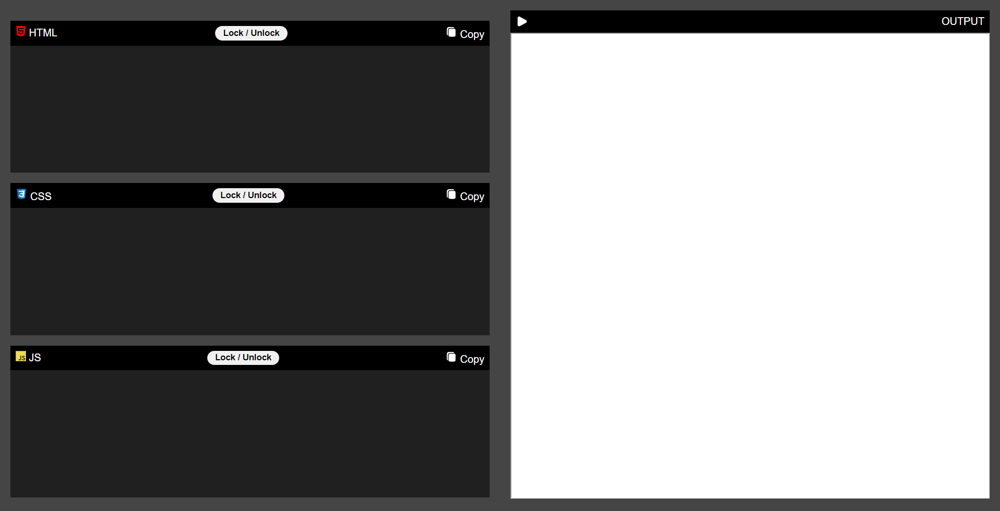
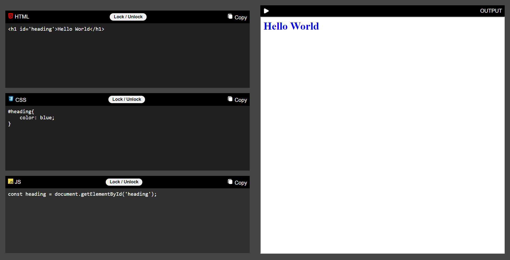
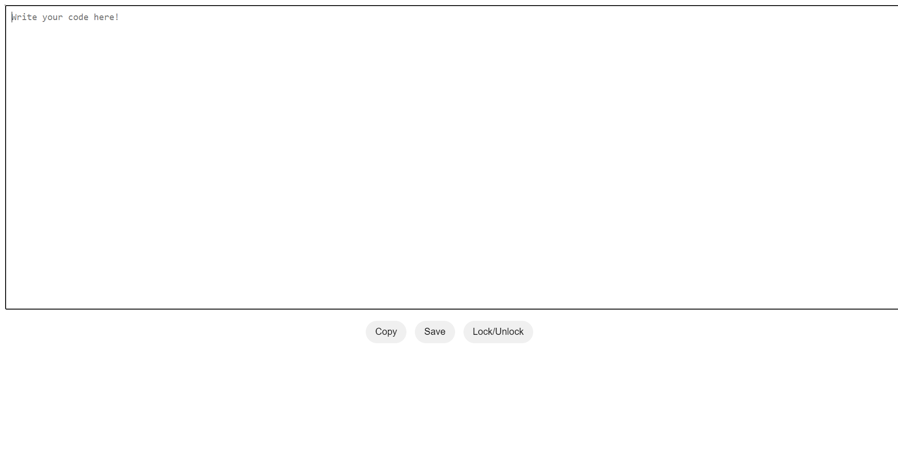

# Basic-Code-Editor
### Codepen Like Code Editor

This is a basic code editor clone like codepen that includes the following features:

* Copy code to clipboard
* Lock/Unlock the workspace
* Indentation on `Tab` key
* Live preview

### Basic Code Editor
This is a basic code editor clone like codepen that includes the following features:

* Copy code to clipboard
* Lock/Unlock the workspace
* Indentation on `Tab` key
* Save code to file

### How to use

1. Type or paste code into the code editor.
2. Use the copy button to copy the code to your clipboard.
3. Use the save button to save the code to a file.
4. Use the lock/unlock button to lock the code editor so that it cannot be edited.
5. Use the indentation feature to indent your code.

### Technologies used

* HTML
* CSS
* JavaScript
